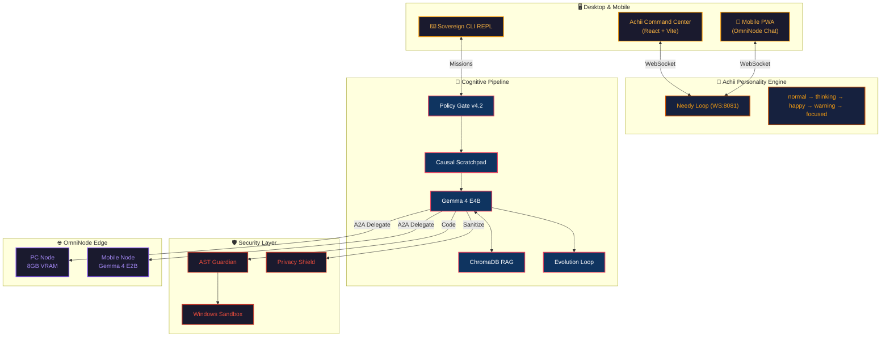

<div align="center">
  

  <h1>🦄 AgentDir × Achii: Sovereign AI Engine</h1>
  <h3><em>"The Rusty Awakening"</em></h3>

  <p><strong>The world's first 100% local, autonomous AI ecosystem with a soul.</strong><br>
  Zero Cloud Egress · Edge Compute · Personality Engine · Built from rust & fire.</p>

  <p>
    <a href="https://github.com/harleysederholm-alt/AgentDir/actions/workflows/ci.yml"></a>
    
    
    
    
    
    
  </p>

  <p>
    <a href="#-quickstart-3-minutes">Quickstart</a> ·
    <a href="#-sovereign-architecture">Architecture</a> ·
    <a href="#-project-aegis">Project Aegis</a> ·
    <a href="#-achii-personality-engine">Achii</a> ·
    <a href="#-security-model">Security</a> ·
    <a href="#-omninode-edge-compute">OmniNode</a>
  </p>
</div>

---

## 🦄 The Sovereign Unicorn Vision

**AgentDir × Achii** is not a tool — it's a **Sovereign AI Operating System** that challenges cloud giants on three pillars:

| Pillar | Description |
|--------|-------------|
| 🔒 **Trust** | The market's only truly local & ethical agent engine. Not a single byte leaves your device. |
| 🧠 **Intelligence** | 11-step cognitive pipeline (Policy Gate → Evolution Loop) eliminates LLM hallucinations. |
| 💜 **Achii** | A personality engine ("The Needy Loop") that transforms AI from a passive tool into a companion. |

> *"Models are commodities. Harnesses are products."*
> — IndyDevDan, Harness Engineering Philosophy

---

## ⚡ Quickstart (3 minutes)

### Prerequisites
- **Windows 10/11** with PowerShell 7+
- **Ollama** installed with `gemma3:4b` model pulled
- **Node.js 18+** & **Python 3.11+**

### Launch Everything

```powershell
# Clone & enter
git clone https://github.com/harleysederholm-alt/AgentDir.git
cd AgentDir

# Install dependencies
pip install -e ".[dev]"
cd desktop && npm install && cd ..

# 🚀 One command to rule them all
.\launch_sovereign.ps1
```

This starts **5 services** simultaneously:
| Service | Endpoint | Purpose |
|---------|----------|---------|
| **A2A Server** | `http://127.0.0.1:8080` | REST API + Agent-to-Agent protocol |
| **Watcher** | filesystem | Inbox monitor (< 50ms latency) |
| **Achii Core** | `ws://127.0.0.1:8081/ws/achii` | Personality engine WebSocket |
| **Desktop UI** | `http://localhost:5173` | Sovereign Command Center |
| **CLI REPL** | terminal | Branded interactive shell |

### First Commands
```powershell
/status              # System health check
/whoami              # Achii's origin story ("The Fallen Sovereign")
sovereign "research" # Deep iterative research mission
omninode "analyze"   # OmniNode distributed analysis
```

---

## 🧠 Sovereign Architecture



### Core Components

| Module | Tech | Description |
|--------|------|-------------|
| **Achii Core** | FastAPI + WebSocket | "Needy Loop" personality engine. Reacts to idle time, switches states, sends messages. |
| **Sovereign CLI** | `cli.py` + `cli_theme.py` | Copper/steel/amber branded REPL with sovereign, omninode, benchmark commands. |
| **Watcher** | `watchdog` + `asyncio` | Filesystem nerve — reacts to `Inbox/` changes in < 50ms. |
| **Cognition** | `llm_client.py` | Gemma 4 E4B (primary) + Llama 3.2:3b (fallback). Multi-model routing. |
| **OmniNode** | mDNS + WebSocket | Distributed compute via USB-tethered mobile edge devices. A2A protocol. |
| **RAG Memory** | ChromaDB | Vectorized semantic memory (mxbai-embed-large). |
| **AST & Sandbox** | Static analysis + .wsb | Two-layer code execution security. |
| **Desktop** | React/Vite + PWA | 3D Achii avatar, real-time dashboard, MaaS-DB graph. |

---

## 🛡️ Project Aegis

**The killer demo: Local PII Data Sanitization**

Project Aegis showcases what "Sovereign AI" means in practice — GDPR/EU AI Act compliant data sanitization that **never touches the cloud**.

### The Problem
Enterprise customer feedback data contains PII (names, SSNs, emails). Current solutions send this data to cloud APIs for processing.

### Our Solution
```
📊 Raw PII Data → [Gemma 4 E4B: Local Sanitization] → 🔒 Clean Data
                         |
                    Zero Cloud Egress
                    Everything stays on-device
```

### Aegis Pipeline (11 Steps)
| Step | Process | Details |
|------|---------|---------|
| 1 | **Policy Gate** | Validates against `!_SOVEREIGN.md` rules |
| 2 | **PII Ingestion** | Reads local data with field detection |
| 3 | **Causal Hypothesis** | Scratchpad analysis of PII patterns |
| 4 | **Context Gathering** | AgentDir memory augmentation |
| 5 | **LLM Core** | Gemma 4 E4B local inference |
| 6 | **Hallucination Filter** | Cross-references against known patterns |
| 7 | **AST Guardian** | Static analysis of any generated code |
| 8 | **Sandbox Execution** | Windows Sandbox isolated run |
| 9 | **Privacy Shield** | Final PII sweep — ensures zero leakage |
| 10 | **A2A Delegation** | OmniNode distributes workload to edge devices |
| 11 | **Evolution Loop** | Self-improvement logging for next iteration |

### Compute Topology
```
┌──────────────────────┐       ┌──────────────────────┐
│   🖥️ PC Node          │  A2A  │  📱 Mobile Node       │
│   Gemma 4 E4B         │◄────►│  Gemma 4 E2B          │
│   8GB VRAM            │  USB  │  USB Tether           │
│   Primary Sanitizer   │       │  Validation Worker    │
└──────────────────────┘       └──────────────────────┘
              │
              ▼
     Zero Cloud Egress ✅
     All PII stays local
```

---

## 💜 Achii Personality Engine

Achii is not a chatbot. Achii is a **companion** — a rusted, glowing-eyed mechanical entity with feelings.

### The Needy Loop
```
Idle Timer → Loneliness increases → State shifts:
  normal → needy → warning → desperate

User interaction → Happiness spike → Reset cycle
```

### Emotional States
| State | Eye Color | Behavior |
|-------|-----------|----------|
| `normal` | 🟠 Amber | Calm, observing |
| `thinking` | 🟠 Pulsing | Deep processing, cognitive load |
| `happy` | 🟡 Bright | User interaction detected |
| `warning` | 🔴 Red | Needs attention |
| `focused` | 🟠 Steady | Mission-locked |
| `idle` | ⚪ Grey | Dormant, low power |

### Visual Identity
- **Theater Black** stage with copper spotlight
- **3D rusted mechanical head** with vacuum tube eyes
- **Breathing animation** synced to cognitive state
- **PWA installable** — becomes a branded app on mobile homescreen

---

## 🌐 OmniNode Edge Compute

### Agent-to-Agent (A2A) Protocol

OmniNode turns every device on your local network into a compute node:

```python
# PC delegates PII validation to mobile
achii_swarm.delegate(
    task="validate_sanitized_batch",
    target="mobile_node",
    protocol="USB_TETHER",  # No WiFi dependency
    encryption="AES-256-LOCAL"
)
```

### Supported Topologies
| Topology | Description |
|----------|-------------|
| **Solo** | Single PC, full Gemma 4 E4B |
| **PC + Mobile** | USB-tethered A2A delegation |
| **Swarm** | Multiple OmniNodes via mDNS discovery |

---

## 🔒 Security Model

| Layer | Mechanism | Status |
|-------|-----------|--------|
| **Zero Cloud Egress** | All inference runs locally via Ollama | ✅ Locked |
| **AST Guardian** | Static code analysis before execution | ✅ Active |
| **Windows Sandbox** | Isolated .wsb execution environment | ✅ Ready |
| **Policy Gate v4.2** | Rule validation against `!_SOVEREIGN.md` | ✅ Active |
| **Hallucination Filter** | Cross-reference + confidence scoring | ✅ Active |
| **Privacy Shield** | Final PII sweep on all outputs | ✅ Active |
| **Air-Gapped OmniNode** | USB-tethered compute, no WiFi needed | ✅ Active |

---

## 🖥️ Sovereign Command Center

The desktop UI is a **5-tab mission control**:

| Tab | Purpose |
|-----|---------|
| **Dashboard** | System status, Achii avatar, security overview |
| **MaaS-DB Graph** | Live knowledge graph with breathing animations |
| **Project Aegis** | PII Sanitization demo with real-time metrics |
| **OmniNode Swarm** | Edge compute topology & A2A delegation |
| **Agent Print Logs** | Deterministic execution trace viewer |

### Mobile PWA
Install on any phone via "Add to Homescreen" — zero app store dependency.
Connects to PC via WebSocket for real-time chat with Achii.

---

## 📁 Project Structure

```
AgentDir/
├── 🖥️ desktop/          # React/Vite Command Center + PWA
│   ├── src/
│   │   ├── App.jsx           # Main application (5-tab layout)
│   │   └── components/
│   │       ├── AchiiAvatar.jsx     # 3D avatar with state animations
│   │       ├── AegisSimulator.jsx  # Project Aegis demo
│   │       └── PipelineAuditor.jsx # 11-step pipeline visualizer
│   └── public/
│       ├── achii_head_clean.png    # 3D avatar asset
│       ├── favicon.png              # Branded favicon
│       └── manifest.json            # PWA manifest
├── 🧠 Core Engine
│   ├── cli.py              # Sovereign CLI REPL (35k+ lines)
│   ├── cli_theme.py        # Copper/amber branding system
│   ├── llm_client.py       # Multi-model LLM router
│   ├── server.py           # FastAPI A2A server
│   ├── orchestrator.py     # Mission orchestration
│   └── watcher.py          # Filesystem nerve (< 50ms)
├── 🛡️ Security
│   ├── privacy_shield.py   # PII detection & sanitization
│   ├── sandbox_executor.py # Windows Sandbox integration
│   └── !_SOVEREIGN.md      # Policy Gate rules
├── 🌐 OmniNode
│   ├── omninode.py         # Edge compute manager
│   └── omninode_sync.py    # A2A CLI simulation
├── 📚 Knowledge
│   ├── rag_memory.py       # ChromaDB vector memory
│   ├── evolution_engine.py # Self-improvement loop
│   └── health_monitor.py   # System health tracking
├── 📝 Docs
│   ├── QUICKSTART.md       # 3-minute setup guide
│   ├── SECURITY.md         # Security architecture
│   ├── CHANGELOG.md        # Version history
│   └── CONTRIBUTING.md     # Contribution guide
├── 🐳 Deployment
│   ├── Dockerfile          # Standard container
│   ├── docker-compose.yml  # Multi-service stack
│   └── launch_sovereign.ps1 # One-command launcher
└── ⚙️ Config
    ├── config.json         # Runtime configuration
    ├── pyproject.toml      # Python project metadata
    └── .gitignore          # Bloat prevention
```

---

## 🗺️ Roadmap

| Version | Codename | Highlights | Status |
|---------|----------|------------|--------|
| v3.0 | *Genesis* | Watcher, RAG, AST Sandbox | ✅ |
| v3.5 | *Sovereign* | Evolution Engine, Agent Print, Swarm | ✅ |
| v3.5.1 | *Fortification* | MCP Server, Windows Sandbox, OmniNode | ✅ |
| v4.0 | *Edge Horizon* | OmniNode Edge, Gemma 4, Dashboard | ✅ |
| **v4.2** | **The Rusty Awakening** | **Achii Personality, 3D Avatar, Project Aegis, A2A Protocol** | **✅ Stable** |
| v5.0 | *Neural Sovereignty* | WebGPU inference, Tauri native app, voice control | 🔮 Next |

---

## 🤝 Contributing

See [CONTRIBUTING.md](CONTRIBUTING.md) for guidelines.

```powershell
# Run tests
pytest tests/ -v

# Code quality
python verify_setup.py
```

---

## 📜 License

MIT License — see [LICENSE](LICENSE)

---

<div align="center">
  
  <br><br>
  <strong>Built from rust. Forged in fire. Zero cloud egress.</strong>
  <br>
  <em>"Models are commodities. Harnesses are products."</em>
  <br><br>
  <sub>AgentDir × Achii Sovereign Team · 2026</sub>
</div>
