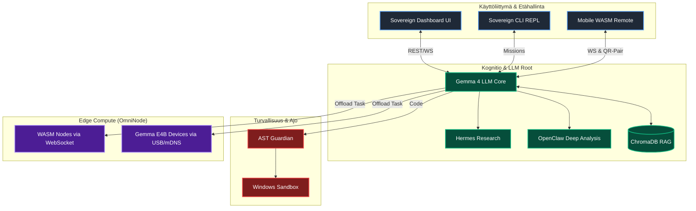

<div align="center">
  

  <h1>🧬 AgentDir Sovereign Engine 4.0 (Edge Architecture)</h1>

  <p><strong>Maailmanluokan 100% lokaali asynkroninen tekoäly-ekosysteemi.</strong><br>
  Tuo autonomiset tekoälyagentit suoraan tiedostojärjestelmään ja ohjaa laskenta lennosta kytkettäviin Edge-laitteisiin.</p>

  <h3>👉 <a href="QUICKSTART.md">Pika-aloitus (3 min)</a> 👈</h3>

  <p>
    <a href="https://github.com/harleysederholm-alt/AgentDir/actions/workflows/ci.yml"></a>
    
    
    
    
    
  </p>
</div>

---

## 🚀 Vision: AI-Native Distributed Ecosystem

**Jokainen kansio on itsenäinen, oppiva tekoälyagentti – ja jokainen laite on laskentasolmu.**

AgentDir Sovereign Engine 4.0 on täydellinen asynkroninen tekoäly-ohjelmistoarkkitehtuuri. Se muuttaa paikallisen hakemistosi älykkääksi reaktoriksi: Pudota tiedosto `Inbox/`-kansioon → Agentti herää lennosta, tutkii (Hermes), analysoi (OpenClaw), suorittaa koodin turvallisessa hiekkalaatikossa (Win Sandbox) ja palauttaa validoidun raportin. Yksikään tavu ei poistu lokaalista ympäristöstäsi.

### 📱 Uutta v4.0:ssa: Zero-Install OmniNode & Gemma 4 Edge
Sovereign Enginen kenties maagisin ominaisuus on tuki saumattomalle **Gemma 4 Edge (E2B/E4B)** verkotukselle.
- **Zero-Install WebAssembly**: Skannaa pääkoneelta QR-koodi älypuhelimesi selaimessa, ja puhelin muuttuu osaksi päättelyverkkoa (WASM).
- **USB-Tethering & mDNS**: Kytke vanha älypuhelin tai Raspberry Pi USB-kaapelilla kiinni isäntäkoneeseen. Isäntäkone offloadaa raskaat OpenClaw-analyysit välittömästi eristettyyn Edge-laitteen omaan llama.cpp / Gemma 4 E4B -piiriin. Lue lisää: [USB_COMPUTING.md](docs/USB_COMPUTING.md).

---

## 🧠 Sovereign Architecture



### Keskeiset Komponentit

| Moduuli | Teknologia | Kuvaus |
|---------|-------------|---------|
| **Hermosto (Watcher)** | `watchdog` + `asyncio` | Reagoi `Inbox/` -kansioon ilmestyviin syötteisiin < 50ms latenssilla. Osaa käsitellä massiivisia rinnakkaisia tietuetaakkoja. |
| **Kognitio (LLM Gateway)**| `llm_client.py` | Ohjaa päälaskennan (Ollama / Gemma 4). Toimii orkestraattorina koko verkolle. |
| **OmniNode Edge** | `WebAssembly / mDNS` | Mahdollistaa laskennan hajauttamisen USB-tetheröityihin mobiililaitteisiin (**Gemma 4 E2B/E4B**) täysin Zero-Install periaatteella. |
| **AST & Win Sandbox** | Lokaali Eristys | Kaksikerroksinen suojaus: AST-skannaus ja Microsoft Windows Sandbox (.wsb) estämään vaaralliset ajot isäntäkäyttöjärjestelmässä täysin irrotetusti. |
| **RAG-Muisti** | `ChromaDB` | Vektoroitu semanttinen lyhyt- ja pitkäkestoinen muisti (Embedding: `mxbai-embed-large`). |
| **Hermes & OpenClaw** | Työnkulut | Vahvasti asynkroniset kognitiotyönkulut tauottomaan iteratiiviseen tutkimukseen ja syväpäättelyyn. |

---

## ⚡ Universal Sovereign Launch (Asennus & Käyttö)

Sovereign Engine hylkää paloitellut scriptit. Kokonaisuus ajetaan ylös yhdellä interaktiivisella komentoketjulla.

**Vaatimukset:**
- Python 3.10+
- [Ollama](https://ollama.com) asennettuna taustalla.

**1. Käynnistä "Matrix" (Kaikki järjestelmät Liveen)**
```powershell
.\launch_sovereign.ps1
```

Skripti laukaisee Watcherin, RAG-kannan, FastAPI-palvelimen (UI ja WebSocketit) sekä Sovereign CLI:n yhdessä synkronoidussa instanssissa.

### Tehtävien Anto
Käyttö on yksinkertaista. Pudota dokumentteja, csv-tiedostoja tai komentoja `Inbox/` kansioon joko ohjelmallisesti, käyttöliittymän upload-painikkeesta, komentoriviltä, tai kauko-ohjaimena toimivalta kännykältä!

---

## 🛡️ Sovereign Security Model

**Täysi lokaali ilmaherruus.** Järjestelmä sijaitsee kokonaan sinun laitteistollasi:
1. **Zero Cloud Egress:** Kaikki inferenssi lokaalisti asennetuilla malleilla. Yksikään koodirivi tai dokumentti ei poistu laitteelta.
2. **Kaksikerroksinen Sandbox:** AST-skannaus estää vaaralliset kutsut → Windows Sandbox (.wsb) varmistaa OS-tason eristyksen suoritukselle.
3. **Air-Gapped OmniNode:** USB-tetheröity lisälaskentateho ei nojaa WiFi-verkkoon, vaan rakentaa tunkeutumattoman oman USB/IP-väylän laitteiden välille.

---

## 🗺️ Roadmap

| Vaihe | Kuvaus | Status |
|-------|--------|--------|
| v3.0 | Perusarkkitehtuuri (Watcher, RAG, AST Sandbox) | ✅ Valmis |
| v3.5 | Sovereign Engine (Evoluutio, Agent Print, Swarm) | ✅ Valmis |
| v3.5.1 | MCP Server, Win Sandbox, Hermes & OpenClaw | ✅ Valmis |
| **v4.0** | **OmniNode Edge (WASM/USB mDNS), Gemma 4 E2B/E4B -arkkitehtuuri, Dashboard UI** | ✅ **Valmis (Stable)** |

---

<div align="center">
  <p>Rakennetaan ohjelmistofilosofian vapaata tulevaisuutta. 🚀</p>
  <i>- AgentDir Sovereign Team</i>
</div>
