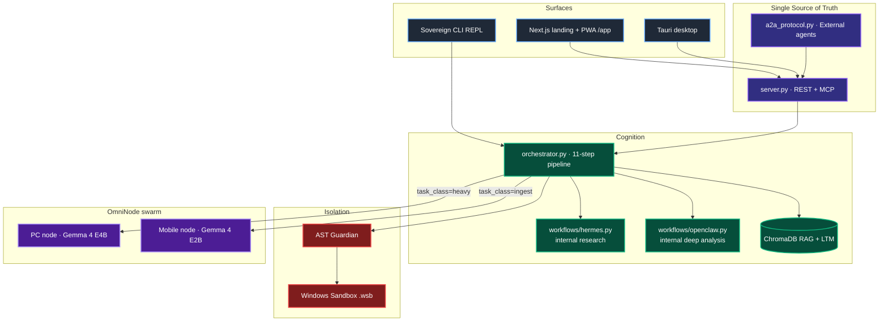

<div align="center">
  

  <h1>AgentDir Sovereign Engine</h1>

  <p><strong>The deterministic cognitive harness for local AI.</strong><br>
  Every folder is an autonomous agent. Every device is a compute node.
  Zero cloud egress.</p>

  <p>
    <a href="https://github.com/harleysederholm-alt/AgentDir/actions/workflows/ci.yml"></a>
    
    
    
    
    
  </p>

  <p>
    <a href="QUICKSTART.md">Quickstart</a> ·
    <a href="docs/04-Architecture/API_SYMBIOSIS.md">API surface</a> ·
    <a href="SYSTEM_STATUS.md">v4.2 audit</a> ·
    <a href="https://agent-dir-one.vercel.app/">Landing + PWA</a>
  </p>
</div>

---

## Why this exists

Most "AI frameworks" are a `fetch()` call to a cloud endpoint wrapped in
five thousand lines of glue. That is not engineering — that is
outsourcing. AgentDir takes the opposite position:

> **The model is a commodity. The harness is the product.**

Every agent is a folder on your disk. Every compute node is a device
you own. Every reasoning step leaves a signed, auditable trace
(`outputs/agent_print_*.json`). The model never leaves the machine. The
logs never leave the LAN. The thing is yours.

---

## MaaS-DB vs. RAG — and why it matters

The common answer to "how does my agent remember?" is to stuff every
artefact into a vector DB (RAG) and hope cosine similarity does the
rest. This works until it doesn't — and when it doesn't, your agent
quietly hallucinates.

AgentDir uses a two-tier memory we call **MaaS-DB** (*Model-as-a-Database*):

| Tier               | Implementation                    | When it wins                                       |
|--------------------|-----------------------------------|----------------------------------------------------|
| **RAG (STM)**      | ChromaDB + `mxbai-embed-large`    | Fuzzy retrieval over unstructured context.         |
| **Ground-Truth (LTM)** | `memmachine` — verified facts only | Deterministic lookup of *committed* conclusions.   |

A fact only reaches LTM after surviving the full sandboxed pipeline
(policy gate → causal hypothesis → RAG-assisted reasoning → sandbox
execution → successful output). The result: the model is not just
*asked* to remember — it is *forced* to earn the privilege.

---

## The 11-Step Sovereign Pipeline

Every task runs the same deterministic pipeline in
`orchestrator.WorkflowOrchestrator.run()`. The steps are not
negotiable — that is the whole point of a harness.

| # | Stage                                 | Module                           |
|---|---------------------------------------|----------------------------------|
| 1 | Policy gate (EU AI Act Art. 13)      | `workspace.policy`               |
| 2 | Causal hypothesis (*before* execution) | `workspace.causal`               |
| 3 | Context retrieval (`/wiki` + `/raw`) | `workspace.retrieval`            |
| 4 | RAG query                             | `workspace.rag` · ChromaDB       |
| 5 | LTM ground-truth merge (Hermes mode) | `workspace.memmachine`           |
| 6 | Model selection (OmniNode-aware)     | `workspace.model_router`         |
| 7 | LLM call                              | `llm_client` → Ollama / any model |
| 8 | Sandbox execution (AST + Win Sandbox) | `sandbox_executor`               |
| 9 | STM → LTM commit (only if verified)  | `workspace.memmachine`           |
|10 | Agent Print (auditable report)       | `workspace.agent_print`          |
|11 | Evolution engine (KPI + prompt auto-tune) | `evolution_engine`           |

Every step is observable. Every step is replayable. Every failure
mode leaves a timestamped artefact on disk.

---

## OmniNode — the two-node swarm

The Sovereign Engine is not a single process. It is a swarm of compute
nodes the user owns, glued together by role-aware routing in
`omninode.py`.

```
         ┌──────────────────────────┐
         │   PC node (role="pc")     │
         │   Gemma 4 E4B IT          │
         │   Heavy cognition:        │
         │   full pipeline, sandbox, │
         │   synthesis               │
         └─────────────┬────────────┘
                       │ WebSocket / mDNS
                       │
         ┌─────────────┴────────────┐
         │ Mobile node (role="mobile") │
         │  Gemma 4 E2B IT           │
         │  Background anchoring,    │
         │  short classification,    │
         │  chat replies             │
         └──────────────────────────┘
```

`orchestrator.run(task, task_class="heavy" | "ingest" | "auto")` picks
the right node. Fallback is loud (logged) rather than silent. See
[`SYSTEM_STATUS.md`](SYSTEM_STATUS.md) §4 for the routing table.

**Why Gemma 4?** The E-series (Effective 2B / 4B) ships native
"Thinking" (chain-of-thought) variants out of the box — a direct match
for AgentDir's Causal Scratchpad. They run on-device via Ollama, `llama.cpp`,
MLX, or WebGPU. The harness, of course, still accepts any local model
(Llama 3, Mistral, Qwen, …) — see `config.json` → `llm.model`.

---

## Architecture



---

## Install

**Requirements**
- Python 3.10+
- [Ollama](https://ollama.com) with a model pulled
  (`ollama pull gemma4:e4b` for the PC node,
   `ollama pull gemma4:e2b` for the mobile node).

**Clone + install**

```bash
git clone https://github.com/harleysederholm-alt/AgentDir.git
cd AgentDir
pip install -e .
```

**Launch everything (Windows)**

```powershell
.\launch_sovereign.ps1
```

**Launch piecewise (Linux / macOS)**

```bash
# 1) start the LLM runtime
ollama serve &

# 2) start the A2A server (REST + Web UI + MCP)
agentdir-server &

# 3) start the file-system watcher (wakes agents on Inbox/ changes)
agentdir-watcher &

# 4) optional — interactive REPL
python cli.py
```

**PWA installation (phone)**
Open [agent-dir-one.vercel.app/app](https://agent-dir-one.vercel.app/app)
→ *Add to Home Screen*. The PWA reads the origin story once, then drops
into `NexusChat`. Pair it to your PC node via the QR flow at
`/download` (see SYSTEM_STATUS §6 Proposal 2 for the roadmap).

---

## Giving the engine tasks

Drop `.txt`, `.md`, `.pdf`, `.csv`, or `.json` into `Inbox/`. The
`watcher.py` hermosto picks it up in under 50 ms and runs the full
11-step pipeline. Output lands in `Outbox/` alongside an auditable
`outputs/agent_print_<id>.json` + `.md` pair.

You can also post a task over the A2A REST surface — see
[`docs/04-Architecture/API_SYMBIOSIS.md`](docs/04-Architecture/API_SYMBIOSIS.md).

---

## Security posture

1. **Zero cloud egress.** All inference runs on local models. No
   document, prompt, or response leaves the machine.
2. **Dual-layer sandbox.** AST analysis blocks dangerous calls; the
   Windows Sandbox `.wsb` runs the code in OS-level isolation.
3. **Air-gapped OmniNode.** USB-tethered mobile compute does not rely
   on Wi-Fi; it builds a dedicated USB/IP channel between devices.
4. **Static API token.** `a2a.api_token` or `AGENTDIR_API_SECRET`
   guards every mutating endpoint. Keyring-backed storage is tracked
   in SYSTEM_STATUS §6 Proposal 1.
5. **EU AI Act Art. 13 auditability.** Every run emits a signed
   Agent Print with task, model, mode, and causal hypothesis.

---

## Roadmap

| Phase    | Scope                                                                             | Status        |
|----------|-----------------------------------------------------------------------------------|---------------|
| v3.0     | Watcher · RAG · AST Sandbox                                                       | Shipped        |
| v3.5     | Sovereign Engine (Evolution · Agent Print · Swarm)                                | Shipped        |
| v3.5.1   | MCP server · Windows Sandbox · internal Hermes + OpenClaw workflows               | Shipped        |
| v4.0     | OmniNode edge (WASM · USB · mDNS) · Gemma 4 E2B/E4B wiring · Dashboard UI         | Shipped        |
| **v4.2** | **A2A protocol scaffold · task-class routing · unified API symbiosis doc · Unicorn README** | **This PR**   |
| v4.3     | PWA ↔ OmniNode rotating-QR pairing (SYSTEM_STATUS §6 Proposal 2)                  | Planned       |
| v5.0     | Hosted / Enterprise inference tier with **TurboQuant** KV compression (Proposal 3)| Planned       |

---

<div align="center">
  <p>Built in public. Built for Builders.</p>
  <p><em>— AgentDir Sovereign Team</em></p>
</div>
