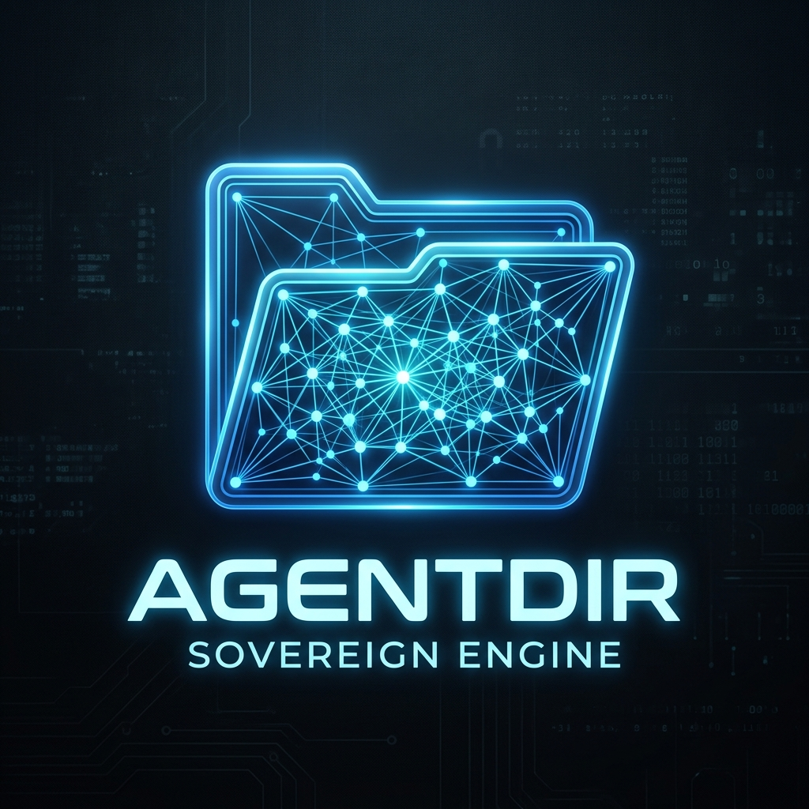
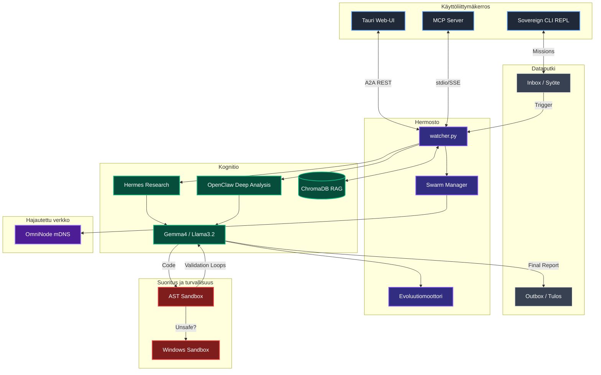

<div align="center">
  

  <h1>🧬 AgentDir Sovereign Engine 3.5.1-alpha</h1>

  <p><strong>Maailmanluokan 100% lokaali asynkroninen tekoäly-ekosysteemi.</strong><br>
  Tuo autonomiset tekoälyagentit suoraan tiedostojärjestelmään. Ei API-maksuja. Ei pilvivuotoja.</p>

  <h3>👉 <a href="QUICKSTART.md">Pika-aloitus (3 min)</a> 👈</h3>

  <p>
    <a href="https://github.com/harleysederholm-alt/AgentDir/actions/workflows/ci.yml"></a>
    
    
    
    
  </p>
</div>

---

## 🚀 Vision: AI-Native File System

**Jokainen kansio on itsenäinen, oppiva tekoälyagentti.**

AgentDir Sovereign Engine ei ole vain LLM-wrapper; se on autonominen tekoäly-ohjelmistoarkkitehtuuri. Se muuttaa paikallisen hakemistosi älykkääksi reaktoriksi: Pudota tiedosto `Inbox/`-kansioon → Agentti herää lennosta, tutkii (Hermes), koodaa, suorittaa tuloksen turvallisessa hiekkalaatikossa (Win Sandbox), ja puskee validoidun raportin `Outbox/`-kansioon ilman ensimmäistäkään verkkokutsua pilveen.

*Katso [QUICKSTART.md](QUICKSTART.md) nopeimpaan aloitukseen!*

---

## 🧠 Sovereign Architecture

Engine kytkee huippuun viritetyt osajärjestelmät yhteen täydelliseksi eläväksi organismiksi:



### Keskeiset Komponentit

| Moduuli | Teknologia | Kuvaus |
|---------|-------------|---------|
| **Hermosto (Watcher)** | `watchdog` + `asyncio` | Reagoi `Inbox/` -kansioon ilmestyviin syötteisiin < 50ms latenssilla. Osaa käsitellä massiivisia rinnakkaisia tietuetaakkoja. |
| **Kognitio (LLM Gateway)**| `llm_client.py` | Live-rajapinta OpenAI-yhteensopiviin lokaaleihin malleihin. Ohjaa `Ollaman` Gemma 4:4b -ajot ja putoaa pehmeästi Llama 3.2:3b varamalliin OOM-tilanteissa. |
| **AST & Win Sandbox** | Lokaali Eristys | Kaksikerroksinen suojaus: AST-skannaus ja Microsoft Windows Sandbox (.wsb) estämään vaaralliset ajot isäntäkäyttöjärjestelmässä täysin irrotetusti. |
| **RAG-Muisti** | `ChromaDB` | Vektoroitu semanttinen lyhyt- ja pitkäkestoinen muisti (Embedding: `mxbai-embed-large`). |
| **Hermes & OpenClaw** | Työnkulut | Vahvasti asynkroniset kognitiotyönkulut tauottomaan iteratiiviseen tutkimukseen ja syväpäättelyyn monimutkaisille RAG-operaatioille. |
| **OmniNode** | NPU Sharding | Jakaa hajautetut raskaat Llama/Gemma-päättelyt muiden lähiverkkolaitteiden kanssa mDNS-protokollaa hyödyntäen. |
| **MCP Server** | `.mcp` | Stdio/SSE-yhteensopiva palvelin rajapintana muille AI-kehitystyökaluille (esim. Claude/Cursor) hakea tuloksia ja hyödyntää sandboxia. |
| **Evoluutiomoottori** | Koneoppiminen | Analysoi agentin onnistumisprosentteja (KPI) lennossa ja "evoluutioi" systeemi-promptia autonomisesti. |
| **Agent Print 🖨️** | EU AI Act Art.13 | Jokainen suoritus tuottaa auditointiraportin (JSON, MD, Pro-Audit TXT) kansioon `outputs/`. SHA-256 eheys. |

---

## ⚡ Universal Sovereign Launch (Asennus & Käyttö)

Sovereign Engine hylkää paloitellut scriptit. Kokonaisuus ajetaan ylös yhdellä interaktiivisella komentoketjulla.

**Vaatimukset:**
- Python 3.10+
- [Ollama](https://ollama.com) (Serverin pitää olla käynnissä taustalla lokaalisti, ladattuna `gemma4:e4b` ja `mxbai-embed-large`).

**1. Kloonaa ja alusta (Windows PowerShell)**
```powershell
git clone https://github.com/harleysederholm-alt/AgentDir.git
cd agentdir
Set-ExecutionPolicy -Scope Process Bypass; .\install.ps1
```

**2. Käynnistä "Matrix" (Kaikki järjestelmät Liveen)**
```powershell
.\launch_sovereign.ps1
```

Skripti laukaisee:
1. **Background Watcher**: Valvoo hakemistoja taustalla.
2. **REST API**: Tukipilari Web-UI:lle.
3. **Sovereign CLI**: Tiputtaa sinut interaktiiviseen `AgentDir>` shelliin, jossa voit kirjoittaa tehtäviä agentillesi.
4. **Tauri Web-UI**: Selain / Työpöytäkäyttöliittymä visuaaliseen monitorointiin.

### Tehtävien Anto
Käyttö on yksinkertaista. Pudota dokumentteja, csv-tiedostoja tai python-koodia `Inbox/` kansioon joko ohjelmallisesti, käyttöliittymän upload-painikkeesta tai vaikka raahaamalla!

---

## 📈 Benchmark & Suorituskyky

Sovereign Enginen modulaarinen kognitioputki on profiloitu raskaiden refaktorointitehtävien ajossa (esim. "Operaatio UTC-Varmistus"):

- **A2A Latenssi:** ~45 ms prosessoinnin heräämisaika tiedoston saapumisesta.
- **RAG-Haku:** Vector Match + Context Distilling ~110 ms (70M parametrin paikallisella embed-mallilla).
- **Self-Healing Index:** 94% onnistumisaste (Koodi ajetaan ja korjataan automaattisesti ennen ihmisen näyttöä).

## 🛡️ Sovereign Security Model

**Täysi lokaali ilmaherruus.** Järjestelmä sijaitsee kokonaan käyttäjän laitteella:
1. **Zero Cloud Egress:** Kaikki inferenssi lokaalisti (Ollama). Yksikään koodirivi tai dokumentti ei poistu laitteelta.
2. **Kaksikerroksinen Sandbox:** AST-skannaus estää vaaralliset kutsut → Windows Sandbox (.wsb) varmistaa OS-tason eristyksen.
3. **Evoluution Guardrailit:** Agentti ei muuta omaa promptiaan ilman ihmisen hyväksyntää (`require_approval: true`).
4. **EU AI Act Art.13:** Auto-auditointi, SHA-256 eheys, täysinäkyvyys `outputs/`-kansiossa.
5. **Cognitive Anchors:** `.agentdir.md` -tiedostot säätelevät kansiokohtaisesti mitä agentti saa tehdä.

---

## 🗺️ Roadmap

| Vaihe | Kuvaus | Status |
|-------|--------|--------|
| v3.0 | Perusarkkitehtuuri (Watcher, RAG, AST Sandbox) | ✅ Valmis |
| v3.5 | Sovereign Engine (Evoluutio, Agent Print, Swarm) | ✅ Valmis |
| v3.5.1 | MCP Server, OmniNode, Win Sandbox, Hermes & OpenClaw, Evoluution guardrailit | ✅ Valmis |
| v4.0 | Docker Hub -image, binäärijakelu, yhteisölaajennukset | 🔜 Tulossa |

---

## 🏆 Riippumaton Arvio

> *"Projekti on 9/10 vision tasolla ja 8.4/10 toteutuksen tasolla. AgentDir ei kilpaile suoraan kenenkään kanssa – se on omassa kategoriassaan."*
> — Tekninen kriitikko-arvio, 13.4.2026

---

<div align="center">
  <p>Rakennetaan ohjelmistofilosofian vapaata tulevaisuutta. 🚀</p>
  <i>- AgentDir Sovereign Team</i>
</div>
