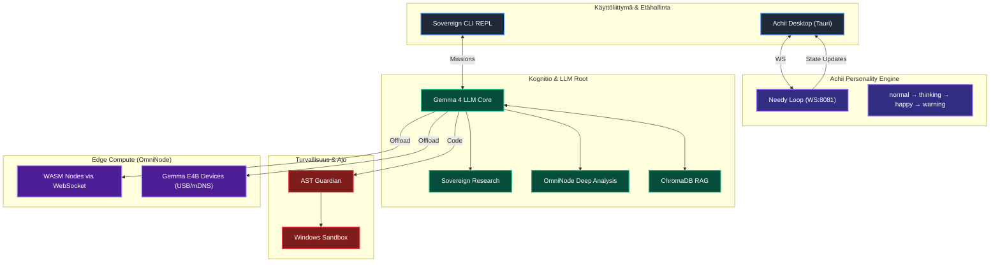

<div align="center">
  

  <h1>🦄 AgentDir x Achii: Sovereign AI Engine v4.2</h1>
  <h3><em>"The Rusty Awakening"</em></h3>

  <p><strong>Maailman ensimmäinen 100% lokaali autonominen tekoäly-ekosysteemi, jossa on sielu.</strong><br>
  Tuo autonomiset tekoälyagentit suoraan tiedostojärjestelmään, ohjaa laskenta Edge-laitteisiin ja anna Achiin pitää huolta kaikesta.</p>

  <h3>👉 <a href="QUICKSTART.md">Pika-aloitus (3 min)</a> 👈</h3>

  <p>
    <a href="https://github.com/harleysederholm-alt/AgentDir/actions/workflows/ci.yml"></a>
    
    
    
    
    
    
  </p>
</div>

---

## 🦄 The Sovereign Unicorn Vision

**AgentDir x Achii** ei ole vain tekoälytyökalu — se on **Sovereign AI Operating System**, joka haastaa pilvijätit kolmella pilarilla:

| Pilari | Kuvaus |
|--------|--------|
| 🔒 **Luottamus** | Markkinoiden ainoa aidosti lokaali ja eettinen agentti-engine. Yksikään tavu ei poistu laitteeltasi. |
| 🧠 **Älykkyys** | 10-askeleen kognitiivinen pipeline (Policy Gate → Evolution Loop) korjaa LLM-mallien hallusinaatiot ja oikomiset. |
| 💜 **Achii** | Persoonallisuusmoottori ("The Needy Loop"), joka tekee tekoälystä kumppanin — ei vain passiivista hakukonetta. |

> *"Mallit ovat hyödykkeitä. Valjaat ovat tuote."*
> — IndyDevDan Harness Engineering -filosofia

---

## 🧠 Sovereign Architecture



### Keskeiset Komponentit

| Moduuli | Teknologia | Kuvaus |
|---------|------------|--------|
| **Achii Core** | `FastAPI + WebSocket` | "Needy Loop" persoonallisuusmoottori. Reagoi käytön taukoon, vaihtaa tilaa, lähettää viestejä. |
| **Sovereign CLI** | `cli.py + cli_theme.py` | Kupari/teräs/amber -brändätty REPL. Sovereign, OmniNode, benchmark, /whoami. |
| **Hermosto (Watcher)** | `watchdog + asyncio` | Reagoi `Inbox/`-kansioon < 50ms latenssilla. |
| **Kognitio (LLM)** | `llm_client.py` | Gemma 4:e4b (ensisijainen), Llama 3.2:3b (fallback). |
| **OmniNode Edge** | `mDNS + WebSocket` | Laskennan hajauttaminen USB-tetheröityihin mobiililaitteisiin. |
| **RAG-Muisti** | `ChromaDB` | Vektoroitu semanttinen muisti (mxbai-embed-large). |
| **AST & Sandbox** | Lokaali eristys | AST-skannaus + Windows Sandbox (.wsb). |
| **Desktop** | `Tauri + React/Vite` | 2D SVG Achii-avatar, 3-paneeli layout, reaaliaikainen chat. |

---

## ⚡ Käynnistys

```powershell
# Kaikki kerralla (server + watcher + achii core + desktop + CLI)
.\launch_sovereign.ps1
```

Skripti käynnistää:
1. **A2A Server** → `http://127.0.0.1:8080`
2. **Watcher** → Inbox-valvoja
3. **Achii Core** → `ws://127.0.0.1:8081/ws/achii`
4. **Desktop UI** → `http://127.0.0.1:5173`
5. **CLI REPL** → tähän terminaaliin

### Ensimmäinen askel
```powershell
# CLI:ssä:
/status           # Järjestelmän tila
/whoami           # Achiin alkuperätarina (The Fallen Sovereign)
sovereign "tutkimus" # Iteratiivinen tutkimus
omninode "task"   # Syväanalyysi
```

---

## 🛡️ Sovereign Security Model

1. **Zero Cloud Egress:** Kaikki inferenssi lokaalisti. Yksikään dokumentti ei poistu laitteelta.
2. **Kaksikerroksinen Sandbox:** AST-skannaus → Windows Sandbox (.wsb).
3. **Air-Gapped OmniNode:** USB-tetheröity laskentateho, ei WiFi-riippuvuutta.
4. **Policy Gate v4.2:** Jokainen agenttitoiminto validoidaan `!_SOVEREIGN.md`-sääntöjä vasten.

---

## 🗺️ Roadmap

| Vaihe | Kuvaus | Status |
|-------|--------|--------|
| v3.0 | Perusarkkitehtuuri (Watcher, RAG, AST Sandbox) | ✅ Valmis |
| v3.5 | Sovereign Engine (Evoluutio, Agent Print, Swarm) | ✅ Valmis |
| v3.5.1 | MCP Server, Win Sandbox, Sovereign & OmniNode | ✅ Valmis |
| v4.0 | OmniNode Edge, Gemma 4, Dashboard UI | ✅ Valmis |
| **v4.2** | **Achii Personality Engine, Desktop App, The Rusty Awakening** | ✅ **Valmis** |

---

<div align="center">
  <p>Rakennetaan ohjelmistofilosofian vapaata tulevaisuutta. 🦄</p>
  <p><em>"Romusta rakennettu, timantiksi hiottu."</em></p>
  <i>— AgentDir x Achii Sovereign Team</i>
</div>
