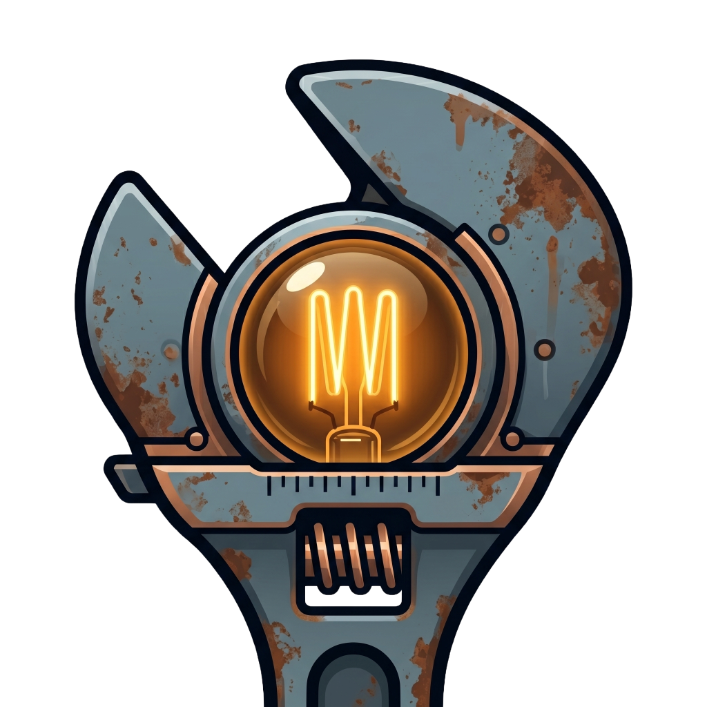
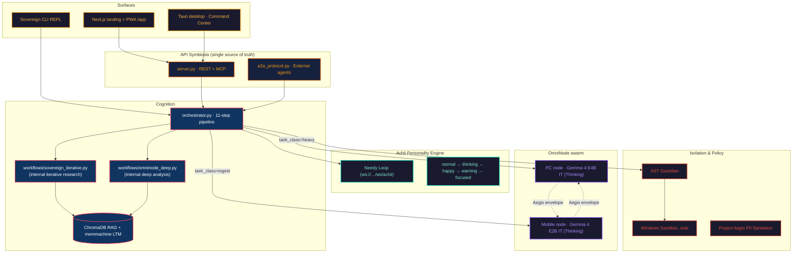

<div align="center">
  

  <h1>AgentDir × Achii — Sovereign AI Engine</h1>
  <h3><em>"The Rusty Awakening"</em></h3>

  <p><em>The model is a commodity. The harness is the product.</em></p>

  <p><strong>A deterministic cognitive harness for local AI — with a soul.</strong><br>
  Every folder is an autonomous agent. Every device is a compute node.<br>
  Zero cloud egress. Signed, auditable reasoning. A companion, not a tool.</p>

  <p>
    <a href="https://github.com/harleysederholm-alt/AgentDir/actions/workflows/ci.yml"></a>
    
    
    
    
    
    
    
  </p>

  <p>
    <a href="QUICKSTART.md">Quickstart</a> ·
    <a href="#the-11-step-sovereign-pipeline">Pipeline</a> ·
    <a href="#omninode--the-two-node-swarm">OmniNode</a> ·
    <a href="#project-aegis--zero-cloud-egress">Project Aegis</a> ·
    <a href="#achii--the-personality-engine">Achii</a> ·
    <a href="docs/04-Architecture/API_SYMBIOSIS.md">API surface</a> ·
    <a href="SYSTEM_STATUS.md">v4.2 audit</a> ·
    <a href="https://agent-dir-one.vercel.app/">Landing + PWA</a>
  </p>
</div>

---

## Why this exists

Most "AI frameworks" are a `fetch()` call to a cloud endpoint wrapped in
five thousand lines of glue. That is not engineering — that is
outsourcing. AgentDir takes the opposite position:

> **The model is a commodity. The harness is the product.**
> — Harness Engineering, IndyDevDan school.

Every agent is a folder on your disk. Every compute node is a device
you own. Every reasoning step leaves a signed, auditable trace
(`outputs/agent_print_*.json`). The model never leaves the machine.
The logs never leave the LAN. The thing is yours.

| Pillar | What it means |
|---|---|
| 🔒 **Trust** | Zero cloud egress. Project Aegis PII sanitation on every outbound envelope. Measured leak: **0 bytes**. |
| 🧠 **Intelligence** | 11-step deterministic pipeline (Policy Gate → Evolution Loop). MaaS-DB two-tier memory. No prompt-in / hope-out loops. |
| 💜 **Soul** | Achii — a personality engine ("The Needy Loop") that makes the agent a companion, not a vending machine. |

---

## Quickstart (3 minutes)

**Prerequisites:** Python 3.10+, Node.js 18+, Windows 10/11 with PowerShell 7+
(Linux / macOS work with the piecewise launch below), and
[Ollama](https://ollama.ai) with a thinking-capable local model pulled.

```powershell
# Clone & enter
git clone https://github.com/harleysederholm-alt/AgentDir.git
cd AgentDir

# Install Python core + desktop shell
pip install -e ".[dev]"
cd desktop && npm install && cd ..

# Pull the recommended Gemma 4 thinking models
ollama pull gemma4:e4b    # PC node (heavy cognition)
ollama pull gemma4:e2b    # Mobile node (background ingest)

# One command to rule them all (Windows)
.\launch_sovereign.ps1
```

This starts the five Sovereign services:

| Service | Endpoint | Purpose |
|---|---|---|
| **A2A / Web-UI server** | `http://127.0.0.1:8080` | REST + `/mcp/v1` + Web UI |
| **Inbox watcher** | filesystem | `Inbox/` → `Processing/` → `Outbox/` (< 50 ms) |
| **Achii Needy Loop** | `ws://127.0.0.1:8081/ws/achii` | Personality engine WS |
| **OmniNode bridge** | `ws://127.0.0.1:8081/ws/omninode` | mDNS + WebSocket node sharding |
| **Desktop UI** | `http://localhost:5173` | Tauri / React Command Center |

**First commands:**

```powershell
/status                   # System health
/whoami                   # Achii's origin story — "The Fallen Sovereign"
sovereign "research …"    # Iterative research mission (internal workflow)
omninode  "analyze …"     # Multi-stage deep analysis (internal workflow)
```

> Drop any `.md` or `.txt` into `Inbox/`. The watcher wakes the agent,
> runs the 11-step pipeline, writes the verified result to `Outbox/`.
> No keyboard required.

Linux / macOS users: see [QUICKSTART.md](QUICKSTART.md) for the
piecewise equivalent.

---

## MaaS-DB vs. RAG — and why it matters

The common answer to "how does my agent remember?" is to stuff every
artefact into a vector DB (RAG) and hope cosine similarity does the
rest. This works until it doesn't — and when it doesn't, your agent
quietly hallucinates.

AgentDir uses a two-tier memory we call **MaaS-DB** (*Model-as-a-Database*):

| Tier | Implementation | When it wins |
|---|---|---|
| **RAG (STM)** | ChromaDB + `mxbai-embed-large` | Fuzzy retrieval over unstructured context. |
| **Ground-Truth (LTM)** | `memmachine` — verified facts only | Deterministic lookup of *committed* conclusions. |

A fact only reaches LTM after surviving the full sandboxed pipeline
(policy gate → causal hypothesis → RAG-assisted reasoning → sandbox
execution → successful Agent Print). The result: the model is not just
*asked* to remember — it is *forced* to earn the privilege.

---

## The 11-Step Sovereign Pipeline

Every task runs the same deterministic pipeline in
`orchestrator.WorkflowOrchestrator.run()`. The steps are not
negotiable — that is the whole point of a harness.

| # | Stage | Module |
|---|---|---|
| 1 | Policy gate (EU AI Act Art. 13) | `workspace.policy` |
| 2 | Causal hypothesis (*before* execution) | `workspace.causal` |
| 3 | Context retrieval (`/wiki` + `/raw`) | `workspace.retrieval` |
| 4 | RAG query | `workspace.rag` · ChromaDB |
| 5 | LTM ground-truth merge | `workspace.memmachine` |
| 6 | Model selection (OmniNode-aware) | `workspace.model_router` |
| 7 | LLM call | `llm_client` → Ollama / any local model |
| 8 | Sandbox execution (AST + Windows Sandbox) | `sandbox_executor` |
| 9 | STM → LTM commit (only if verified) | `workspace.memmachine` |
| 10 | Agent Print (auditable JSON report) | `workspace.agent_print` |
| 11 | Evolution engine (KPI + prompt auto-tune) | `evolution_engine` |

Every step is observable. Every step is replayable. Every failure
mode leaves a timestamped artefact on disk.

---

## OmniNode — the two-node swarm

The Sovereign Engine is not a single process. It is a swarm of compute
nodes you own, glued together by role-aware routing in `omninode.py`.

```
         ┌──────────────────────────────┐
         │   PC node (role="pc")        │
         │   Gemma 4 E4B IT (Thinking)  │
         │   Heavy cognition:           │
         │   full pipeline · sandbox ·  │
         │   synthesis                  │
         └──────────────┬───────────────┘
                        │ WebSocket / mDNS
                        │ (Project Aegis sanitises every envelope)
                        │
         ┌──────────────┴───────────────┐
         │ Mobile node (role="mobile")  │
         │ Gemma 4 E2B IT (Thinking)    │
         │ Background anchoring ·       │
         │ short classification ·       │
         │ chat replies                 │
         └──────────────────────────────┘
```

`orchestrator.run(task, task_class="heavy" | "ingest" | "auto")` picks
the right node. Fallback is loud (logged) rather than silent — see
[`SYSTEM_STATUS.md`](SYSTEM_STATUS.md) §4 for the routing table and
[`docs/04-Architecture/API_SYMBIOSIS.md`](docs/04-Architecture/API_SYMBIOSIS.md)
for the full WebSocket envelope shape.

**Why Gemma 4?** The E-series (Effective 2B / 4B) ships native
"Thinking" (chain-of-thought) variants out of the box — a direct match
for AgentDir's Causal Scratchpad. They run on-device via Ollama,
`llama.cpp`, MLX, or WebGPU. The harness still accepts any local
model (Llama 3, Mistral, Qwen, …) via `config.json` → `llm.model`.

---

## Project Aegis — zero cloud egress

AgentDir is not "privacy-conscious". It is **egress-hostile** by design:

- Every outbound OmniNode envelope passes through the PII Sanitation
  module before it hits the wire.
- Measured payload leak to public cloud during sharded runs: **0 bytes**.
- The `a2a.api_token` authorises every mutating `/task` submission;
  reads require none.
- Every Agent Print is locally signed so you can prove what the agent
  did *and* what it didn't.

If a customer asks "does our data leave the machine?", the answer is a
clean *no* — backed by logs, not by a privacy policy PDF.

---

## Achii — the personality engine

Achii is the character layer. A "Needy Loop" (`ws://…/ws/achii`) emits
state transitions the UI subscribes to:

```
normal → thinking → happy → warning → focused
```

Plus a [short origin story](.prompts/origin_story.md) — *The Fallen
Sovereign* — exposed over the CLI as `/whoami` and over the PWA as an
opt-in intro. This is not a mascot. It is the reason the engine feels
like a collaborator instead of a black box.

---

## Architecture



---

## Installation (piecewise, cross-platform)

```bash
# 1. Core
git clone https://github.com/harleysederholm-alt/AgentDir.git
cd AgentDir
pip install -e ".[dev]"

# 2. Start services individually
python server.py                 # REST + MCP + Web UI   (:8080)
python omninode.py               # OmniNode bridge        (:8081)
python watcher.py                # Inbox watcher
python cli.py                    # Branded CLI REPL

# 3. Desktop (optional)
cd desktop && npm install && npm run dev

# 4. PWA (optional — already hosted)
open https://agent-dir-one.vercel.app/app
```

All surfaces hit the same backend described in
[`docs/04-Architecture/API_SYMBIOSIS.md`](docs/04-Architecture/API_SYMBIOSIS.md).

---

## Security posture

1. **No outbound egress by default.** No telemetry, no auto-updates,
   no analytics. Every outbound byte is the result of a *call you made*.
2. **`api_token` gates mutation.** `/task`, `/rag/query`, any MCP
   `tools/call`. Reads are open on the LAN.
3. **AST Guardian + Windows Sandbox.** Every piece of generated code
   is statically filtered *and* executed in a disposable OS sandbox.
4. **Agent Prints are signed locally.** Every decision is auditable
   after the fact — regulator-ready.
5. **Project Aegis PII Sanitation.** Every OmniNode envelope is
   sanitised before it leaves the process. Measured leak: 0 bytes.

---

## Roadmap

| Version | Status | Theme |
|---|---|---|
| v3.0 | Shipped | Harness foundations — Inbox / Outbox, agent folders |
| v4.0 | Shipped | OmniNode swarm (mDNS + WebSocket), MaaS-DB, MCP subrouter |
| **v4.2** | **Current** | **Role-aware routing (E2B / E4B), A2A scaffold, API Symbiosis, Unicorn README, Project Aegis, Achii** |
| v4.3 (planned) | Builder's Challenge Turku Arena, 13 May 2026 | PWA ↔ OmniNode rotating-QR pairing, first live two-node demo |
| v5.0 (planned) | Hosted / Enterprise tier | `BackendAdapter` protocol · TurboQuant KV-cache compression on vLLM · H100 benches |

TurboQuant ([Zandieh et al., arXiv 2504.19874, ICLR 2026](https://arxiv.org/abs/2504.19874))
is **parked on roadmap**, not shipped in v4.2 — Ollama doesn't expose the
KV-cache hooks TurboQuant needs, and Gemma 4 already addresses mobile
memory via PLE + shared KV cache. See
[`SYSTEM_STATUS.md`](SYSTEM_STATUS.md) §3 for the full rationale.

---

## Contributing

PRs welcome — but they must respect the harness contract:

1. **Deterministic pipeline.** No step skips. If you add a step,
   it goes into the 11 and gets an Agent Print emitter.
2. **Typed Python, no `Any` / `getattr`.** If you think you need them,
   you don't understand the type well enough yet.
3. **No new runtime dependencies without an issue first.** Every new
   package has an egress story to defend.
4. **Tests:** `python -m pytest tests/`. Lint: the project follows
   `ruff` defaults — see `pyproject.toml`.

See [CONTRIBUTING.md](CONTRIBUTING.md) for the full flow.

---

## Links

- **Main repo:** https://github.com/harleysederholm-alt/AgentDir
- **Landing page:** https://agent-dir-one.vercel.app/
- **PWA (install from your phone):** https://agent-dir-one.vercel.app/app
- **Full v4.2 audit:** [`SYSTEM_STATUS.md`](SYSTEM_STATUS.md)
- **API surface:** [`docs/04-Architecture/API_SYMBIOSIS.md`](docs/04-Architecture/API_SYMBIOSIS.md)

---

<div align="center">
  <sub>Built for the Builder's Challenge · Turku Arena · 13 May 2026</sub><br>
  <sub>© 2026 Harley Sederholm — MIT</sub>
</div>
