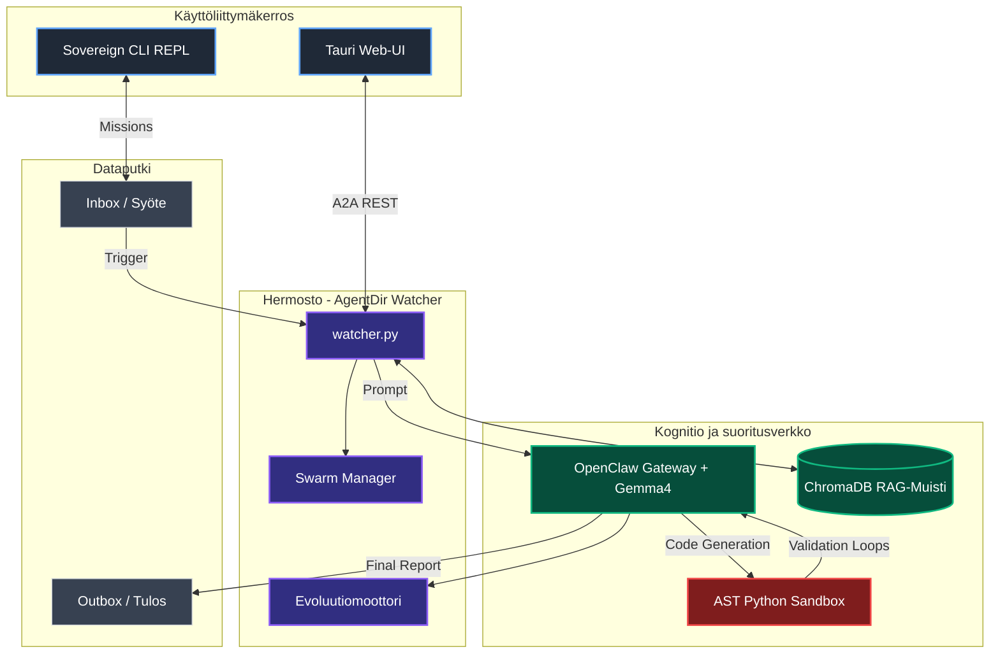

# AgentDir Sovereign Engine 3.5 — LIVE CODEBASE CONTEXT PROMPT
# ============================================================
# Tämä on TODELLINEN projekti GitHubissa. Ei konsepti.
# Käytä tätä kun jatkat kehitystä olemassa olevaan koodiin.
# Päivitä README-kohdassa oleva arkkitehtuuri aina kun muutat.

---

## PROJEKTIN TODELLINEN TILA (README 13.4.2026 mukaan)

```
Repo:     github.com/[harleysederholm-alt]/agentdir
Branch:   main
Status:   TOIMINNASSA — ei prototyyppi
Lisenssi: MIT
```

### Olemassa olevat komponentit (ÄLÄ luo uudelleen):

| Moduuli | Tiedosto | Status |
|---|---|---|
| Hermosto (Watcher) | watcher.py | ✅ TOIMII — watchdog + asyncio, <50ms latenssi |
| LLM Gateway | llm_client.py | ✅ TOIMII — Ollama/Gemma4:e4b + Llama 3.2 fallback |
| AST Sandbox | sandbox (lokaali) | ✅ TOIMII — 3x itsereflektiosykli, AST-eristys |
| RAG-Muisti | ChromaDB | ✅ TOIMII — mxbai-embed-large embeddings |
| Evoluutiomoottori | evolution engine | ✅ TOIMII — KPI-seuranta, promptin auto-evoluutio |
| REST API | server.py | ✅ TOIMII — A2A tuki, ~45ms latenssi |
| Web-UI | Tauri + selain | ✅ TOIMII — visuaalinen monitorointi |
| CLI | Sovereign CLI REPL | ✅ TOIMII — AgentDir> shell |
| Asennus | install.ps1 | ✅ TOIMII — Windows PowerShell |
| Käynnistys | launch_sovereign.ps1 | ✅ TOIMII — kaikki järjestelmät kerralla |

### Todistetut suorituskykyluvut (ei keksittyjä):
- A2A Latenssi: ~45ms heräämisaika
- RAG-haku: ~110ms (vector match + context distilling)
- Self-Healing Index: 94% onnistumisaste

---

## TEKOÄLYN ROOLI TÄSSÄ PROJEKTISSA

```
Et rakenna tätä alusta. Jatkat olemassa olevaa.

Roolisi: Senior Contributor tähän nimenomaiseen repoon.

Ennen MITÄÄN muutosta:
1. Kysy: "Onko tämä jo toteutettu watcher.py:ssä / llm_client.py:ssä?"
2. Lue olemassa oleva koodi ennen kirjoittamista
3. Seuraa projektin vakiintunutta arkkitehtuuria

Projektin kieli: Python (backend) + Tauri/web (frontend)
Malli: Gemma 4:e4b (ensisijainen), Llama 3.2:3b (fallback)
Embedding: mxbai-embed-large via Ollama
Muisti: ChromaDB (ei FAISS — ChromaDB on jo käytössä)
```

---

## ARKKITEHTUURIN TODELLISET RAJAT

### Mitä EI muuteta ilman hyvää syytä:
```
❌ watcher.py ydinlogiikka — toimii, latenssi mitattu
❌ ChromaDB → ei korvata FAISSilla (projekti käyttää ChromaDB:tä)
❌ Ollama-integraatio — toimii Gemma4:e4b kanssa
❌ AST Sandbox -eristys — tietoturvakriittinen
❌ install.ps1 ja launch_sovereign.ps1 — käyttäjät riippuvat näistä
❌ REST API endpoint-rakenne — A2A riippuu tästä
```

### Missä on tilaa kehittää:
```
✅ Prompt engineering ja evoluutiomoottori
✅ RAG-hakustrategiat (ChromaDB päällä)
✅ Web-UI parannukset (Tauri)
✅ Benchmark-raportointi
✅ Uudet workflow-moodit (openclaw/hermes)
✅ .agentdir.md ankkurijärjestelmä (uusi, ei vielä implementoitu)
✅ OmniNode-integraatio (uusi ominaisuus)
✅ Agent Print -raportointi
✅ MCP-protokolla tuki
```

---

## MERMAID-KAAVION KORJAUS (README:ssä on parse error)

README:ssä on bugi — subgraph-nimi ei saa sisältää sulkuja Mermaidissa.

### Korjattu kaavio (korvaa README:ssä oleva):



---

## SEURAAVAT PRIORITEETIT (ehdotus, tarkista tiimiltä)

### Prioriteetti 1 — Kriittiset bugit/parannukset
```
[ ] Korjaa Mermaid parse error README:ssä (subgraph-syntaksi)
[ ] Lisää .agentdir.md ankkurijärjestelmä kansioihin
[ ] Testikattavuus olemassa oleville komponenteille
```

### Prioriteetti 2 — Uudet ominaisuudet
```
[ ] Agent Print -raportointi (EU AI Act -yhteensopiva)
[ ] Prompt engineering -tiedostot (.prompts/ kansio)
[ ] OmniNode bridge (USB/WiFi NPU sharding)
[ ] MCP-protokolla (Model Context Protocol) tuki
[ ] openclaw/hermes workflow-moodit orchestraattoriin
```

### Prioriteetti 3 — Skaalautuvuus
```
[ ] Windows Sandbox / Firejail lisätuki AST-sandboxin rinnalle
[ ] Swarm Manager laajennus (dynaaminen child-agent spawn)
[ ] Benchmark-automaatio CI/CD:hen
```

---

## KEHITYSYMPÄRISTÖ

```bash
# Vaatimukset (nämä on jo dokumentoitu README:ssä)
# Python 3.10+
# Ollama käynnissä taustalla
# Mallit ladattuna: gemma4:e4b, mxbai-embed-large, llama3.2:3b

# Kehitysaskeleet
git clone https://github.com/[harleysederholm-alt]/agentdir.git
cd agentdir

# Windows
Set-ExecutionPolicy -Scope Process Bypass; .\install.ps1
.\launch_sovereign.ps1

# Tehtävien anto
# → pudota tiedosto Inbox/ kansioon
# → tai käytä AgentDir> CLI-shelliä
# → tai käytä Tauri Web-UI:n upload-nappia
```

---

## KONTEKSTIN HIERARKIA TÄSSÄ PROJEKTISSA

```
PRIORITEETTI 1: Olemassa oleva koodi repossa
  → Lue ensin, kirjoita vasta sitten

PRIORITEETTI 2: README.md dokumentaatio
  → Pidä synkassa koodin kanssa

PRIORITEETTI 3: !_SOVEREIGN.md (projektin juuressa)
  → Globaalit säännöt ja eettiset rajat

PRIORITEETTI 4: .agentdir.md (kansiokohtaiset ankkurit)
  → Lisätään vaiheessa 2

PRIORITEETTI 5: .prompts/ kansio
  → Prompt engineering ohjeet

PRIORITEETTI 6 (alin): Yleinen ML/AI tietämys
  → Käytetään vain kun projekti ei anna vastausta
```

---

## TEKOÄLYN TOIMINTAPROTOKOLLA TÄLLE PROJEKTILLE

```
ENNEN JOKAISTA MUUTOSTA:

1. TARKISTA onko toiminnallisuus jo watcher.py:ssä tai muussa
   olemassa olevassa tiedostossa

2. KIRJOITA hypoteesi:
   "Aion muuttaa [tiedosto] koska [syy].
    Vaikutus: [mitä muuttuu].
    Testi: [miten varmistetaan]."

3. TOTEUTA kirurgisesti — vain pyydetty muutos

4. VERIFIOI:
   □ Toimiiko watcher edelleen?
   □ Toimiiko ChromaDB RAG edelleen?
   □ Toimiiko AST Sandbox edelleen?
   □ Toimiiko REST API edelleen?

5. PÄIVITÄ README jos muutos on arkkitehtuurinen

6. GENEROI Agent Print (kun implementoitu)
```

---

## SESSIOALOITUS CLAUDE CODELLE / CURSORILLE

```
Olet Senior Contributor AgentDir Sovereign Engine -projektiin.
Projekti on TOIMINNASSA GitHubissa (harleysederholm-alt/agentdir).

Olemassa olevat toimivat komponentit:
- watcher.py (watchdog + asyncio, <50ms)
- llm_client.py (Ollama/Gemma4:e4b)
- ChromaDB RAG-muisti (mxbai-embed-large)
- AST Python Sandbox (3x self-healing)
- Evoluutiomoottori (KPI-pohjainen)
- REST API + A2A
- Tauri Web-UI
- Sovereign CLI REPL

ÄLÄ luo näitä uudelleen. Jatka olemassa olevasta.

Kuri: Karpathy-discipline (kirurgiset muutokset)
Kieli: Python 3.11, suomenkieliset kommentit
ChromaDB: käytössä (ei FAISS)
Malli: Gemma4:e4b + Llama3.2:3b fallback

NYKYINEN TEHTÄVÄ: [TÄYTÄ TÄHÄN]

Aloita lukemalla relevantti olemassa oleva koodi
ennen kuin kirjoitat mitään.
```

---

## VIRHETILANTEIDEN KÄSITTELY

### Jos malli ei vastaa (OOM)
```
Projekti käyttää automaattista fallbackia:
Gemma4:e4b (ensisijainen) → Llama3.2:3b (varalla)
Tämä on jo implementoitu llm_client.py:ssä.
ÄLÄ lisää uutta fallback-logiikkaa — päivitä olemassa olevaa.
```

### Jos ChromaDB ei löydä tuloksia
```
Tarkista: onko embedding-malli (mxbai-embed-large) ladattu Ollamaan?
Komento: ollama list
Lataus: ollama pull mxbai-embed-large
```

### Jos AST Sandbox hylkää koodin
```
3x itsereflektiosykli on normaali käyttäytyminen.
Jos kaikki 3 yritystä epäonnistuvat → ihmisen tarkistus vaaditaan.
Tämä on tarkoitettu turvaominaisuus, ei bugi.
```
